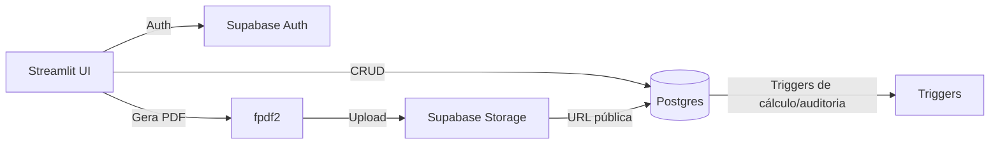

# Gestão de Obras de Pintura - Streamlit App

App de gestão de obras de pintura com interface amigável para usuários 60+.

## Setup completo

### Requisitos

- Python 3.11+
- Conta Supabase com Postgres, Auth e Storage habilitados

### 1. Clone o repositório

```bash
git clone <seu-repositorio>
cd sepol
```

### 2. Crie um ambiente virtual

```bash
python -m venv venv
source venv/bin/activate  # Linux/Mac
# ou
venv\\Scripts\\activate  # Windows
```

### 3. Instale as dependências

```bash
pip install -r requirements.txt
```

### 4. Configure o banco (Supabase)

1. Crie um projeto no Supabase.
2. No SQL Editor, execute os scripts da pasta `sql/` na ordem:
   - `sql/001_core.sql`
   - `sql/002_add_scripts.sql`
   - `sql/003_add_scripts.sql`
3. Verifique que o bucket `orcamentos` existe (ou crie no Storage).

### 5. Configure as variáveis de ambiente

Crie um arquivo `.env` na raiz do projeto:

```env
SUPABASE_URL=https://seu-projeto.supabase.co
SUPABASE_ANON_KEY=sua-anon-key-aqui
```

**IMPORTANTE:** Nunca use a `service_role` key no frontend.

### 6. Execute o app

```bash
streamlit run app.py
```

O app abrirá em `http://localhost:8501`.

## Variáveis de ambiente

| Variável | Descrição | Obrigatória |
| --- | --- | --- |
| `SUPABASE_URL` | URL do projeto Supabase | Sim |
| `SUPABASE_ANON_KEY` | Chave pública (anon) do Supabase | Sim |

Para deploy no Streamlit Cloud, adicione as mesmas chaves em **Settings > Secrets**.

## Arquitetura

- **UI**: Streamlit multipage (`app.py` + `pages/`).
- **Autenticação**: Supabase Auth com verificação de perfil em `public.usuarios_app`.
- **Dados**: Camada de acesso em `utils/db.py` consumindo PostgREST do Supabase.
- **Auditoria**: Triggers em Postgres gravando histórico em tabela de auditoria.
- **PDF**: Geração local via `fpdf2` e upload para Supabase Storage (`bucket orcamentos`).

## Fluxo de dados

1. **Login** → App chama Supabase Auth e grava sessão local.
2. **Carregamento de telas** → `utils/db.py` consulta tabelas e views.
3. **Escrita** → App envia inserts/updates → triggers recalculam totais e registram auditoria.
4. **Orçamentos (PDF)** → `utils/pdf.py` gera o arquivo → upload no Storage → URL pública salva no orçamento.

## Decisões técnicas

- **Streamlit** pela rapidez de entrega e acessibilidade para usuários 60+.
- **Supabase** para unificar Auth, DB e Storage.
- **Triggers SQL** para garantir consistência de totais e auditoria no banco.
- **fpdf2** para geração de PDFs simples sem dependências de browser.

## Diagrama (simplificado)



## Estrutura do Projeto

```
repo(sepol)/
├── app.py                 # Página principal e login
├── pages/
│   ├── 1_🏠_Obras.py
│   ├── 2_👥_Clientes.py
│   ├── 3_👷_Pessoas.py
│   ├── 4_📋_Orcamentos.py
│   ├── 5_📅_Agenda.py
│   ├── 6_💰_Financeiro.py
│   └── 7_⚙️_Configuracoes.py
├── utils/
│   ├── __init__.py
│   ├── auth.py            # Autenticação Supabase
│   ├── db.py              # Consultas ao banco
│   ├── auditoria.py       # Logs de auditoria
│   ├── layout.py          # Componentes compartilhados
│   └── pdf.py             # Geração de PDF
├── sql/
│   ├── 001_core.sql
│   ├── 002_add_scripts.sql
│   └── 003_add_scripts.sql
├── assets/
│   └── logo.png
├── requirements.txt
├── README.md
└── .env.example
```

## Perfis de Usuário

- **ADMIN**: Acesso total (incluindo Financeiro e Configurações)
- **OPERACAO**: Acesso operacional (sem Financeiro/Configurações)

## Suporte

Para dúvidas ou problemas, abra uma issue no repositório.
